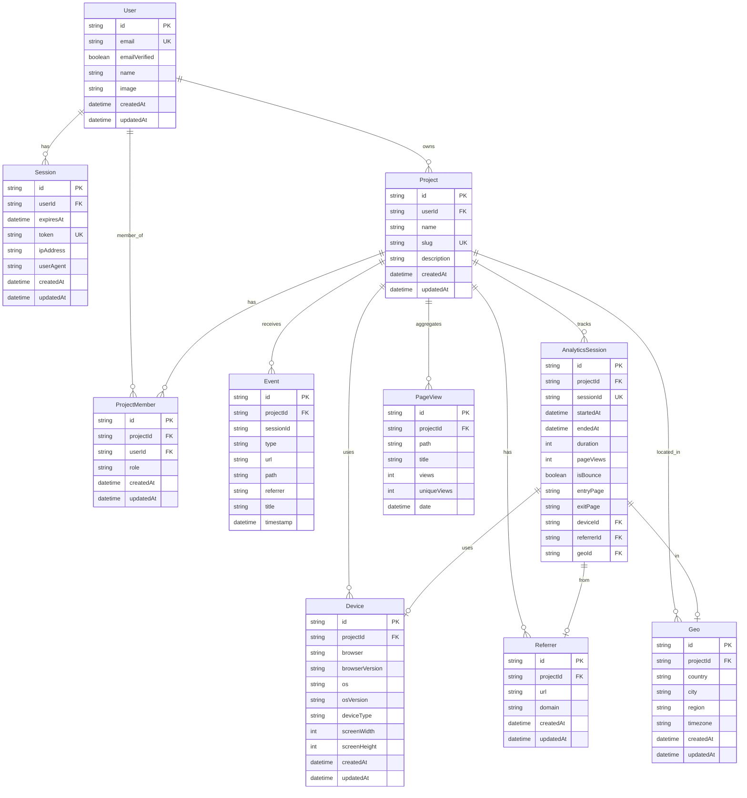

# Entity Relationship Diagram

## Relationships

- **User → Session**: One-to-many (user can have multiple sessions)
- **User → Project**: One-to-many (user can own multiple projects - unlimited!)
- **User → ProjectMember**: One-to-many (user can be a member of multiple projects)
- **Project → Event**: One-to-many (project receives many events)
- **Project → AnalyticsSession**: One-to-many (project tracks many sessions)
- **Project → Device**: One-to-many (project has many devices)
- **Project → Referrer**: One-to-many (project has many referrers)
- **Project → Geo**: One-to-many (project has visitors from many locations)
- **AnalyticsSession → Device**: Many-to-one (sessions use devices)
- **AnalyticsSession → Referrer**: Many-to-one (sessions come from referrers)
- **AnalyticsSession → Geo**: Many-to-one (sessions are from locations)

## Indexes

- `User.email` - Unique index
- `Session.token` - Unique index
- `Session.userId` - Index for user lookups
- `Project.slug` - Unique index
- `Project.userId` - Index for user's projects
- `ProjectMember.projectId_userId` - Composite unique index
- `Event.projectId_timestamp` - Composite index for time-based queries
- `Event.sessionId` - Index for session lookups
- `AnalyticsSession.sessionId` - Unique index
- `AnalyticsSession.projectId_startedAt` - Composite index for date range queries
- `PageView.projectId_path_date` - Composite unique index
- `Device.projectId_browser_os_deviceType_screenWidth_screenHeight` - Composite unique index
- `Referrer.projectId_domain` - Composite unique index
- `Geo.projectId_country_city` - Composite unique index

